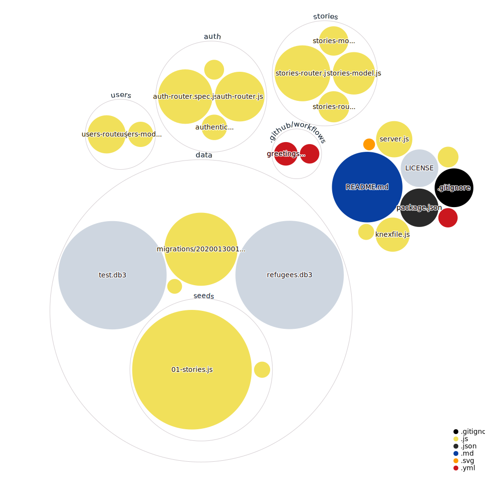

# back-end
Back end developers here (unit 4);

# Back-End for Refugee Stories Build Week
Database, server/api, authentication, testing

# Deployed at
https://refu-stories-backend.herokuapp.com/

## Project title
Refugee Stories 

## Motivation
The app helps share refugee stories to make to raise awareness, and connects volunteers to refugee organizations/charities. It provides real life stories and spreads awareness of the refugee crisis. It promotes empathy. The ultimate goal is to promote human development by responding to a major refugee crisis and nurturing a peaceful and just society.


# <b>Built with</b>
- [Node.js](https://nodejs.org)
- [Express](https://expressjs.com/)
- [SQLite](https://www.sqlite.org/)
- [PostgreSQL](https://www.postgresql.org/)

## Features
What makes your project stand out?

Simplicity and reliability 

## Installation
Clone
Fork
NPM Install

## API Reference

 # Register new user (post)
 https://refu-stories-backend.herokuapp.com/api/auth/register

 expects username, and password. will return user id and authZ token, role is set to `user` by default, to register as an admin set the role to `admin`

 # Login (post)
 https://refu-stories-backend.herokuapp.com/api/auth/login

 expects username, and password. will return a welcome message and authZ token

# Get all users (get) ;  restricted route, need to be registered as an admin
 https://refu-stories-backend.herokuapp.com/api/users

Expect a header authorization token -- returns an array of JS object of users: 

```[
  {
    "id": 1,
    "username": "vlad12",
    "role": "admin"
  },
  {
    "id": 2,
    "username": "vlad16",
    "role": "admin"
  }
]
```

# Delete a user (del) ;  restricted route, need to be registered as an admin
 https://refu-stories-backend.herokuapp.com/api/users/:id

Expect a header authorization token -- returns a message: 

```{
  "removed": 1
}
```

 # Get all user stories (get)
 https://refu-stories-backend.herokuapp.com/api/stories
 Doesn't expect anything -- unsecured route -- returns an array of JS object of stories

 # Get by story id (get)
 https://refu-stories-backend.herokuapp.com/api/stories/:id
 Doesn't expect anything -- unsecured route -- returns JS object of story with id matching the url

 # Get PENDING stories (get) restricted route, need to be logged in as admin
 https://refu-stories-backend.herokuapp.com/api/stories/pending
 Expect a header authorization token -- returns a list of ONLY pending stories

 ```[
  {
    "id": 4,
    "title": "title",
    "contents": "text",
    "name": "",
    "email": "",
    "pending": 1,
    "user_id": null
  },
  {
    "id": 5,
    "title": "title",
    "contents": "text",
    "name": "",
    "email": "",
    "pending": 1,
    "user_id": null
  }
]
```

 # Post a new story (post), restricted route, need to be logged in 
 https://refu-stories-backend.herokuapp.com/api/stories
 expects a body with mandatory title & contents
 body can also include name, email, and user_id
 resolves to the newly added story

 # Edit an existing story (put), restricted route, need to be logged in
https://refu-stories-backend.herokuapp.com/api/stories/:id
 expects a body with title,contents, and story_id 

 # Remove an existing story (delete), restricted route, need to be logged in
 https://refu-stories-backend.herokuapp.com/api/stories/:id
 doesn't expect anything


## Tests

- [Jest](https://jestjs.io/)
- [supertest](https://www.npmjs.com/package/supertest)

npm run server
npm run test

## Contribute
Contact the author - https://github.com/nezlobnaya

## License
- [MIT] (https://opensource.org/licenses/MIT)



MIT © [nezlobnaya](Vlad Burlutskiy);
